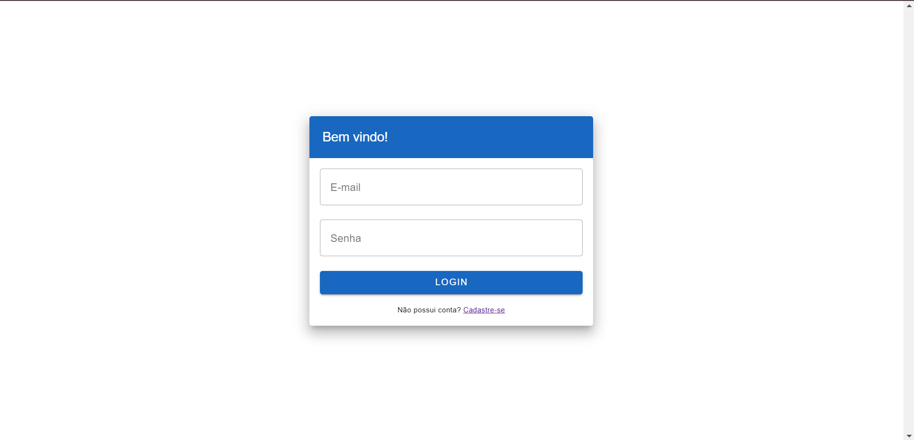
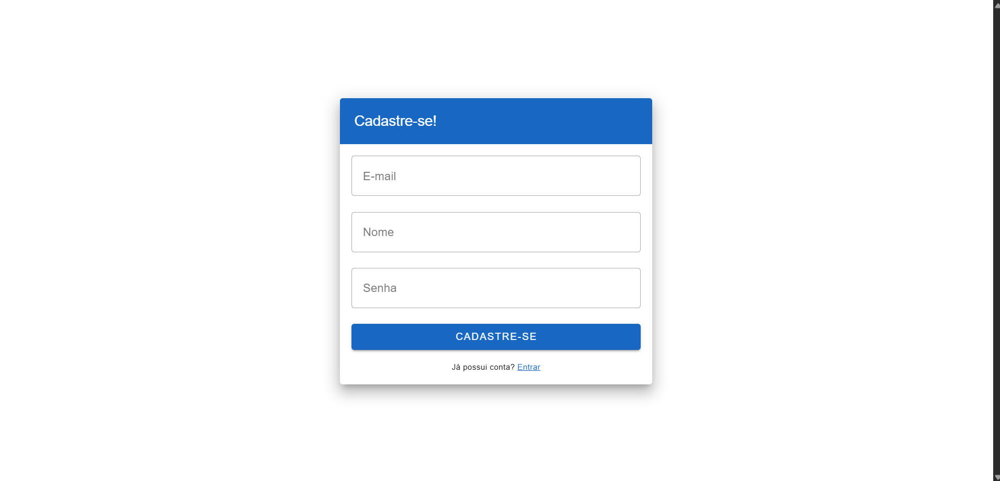
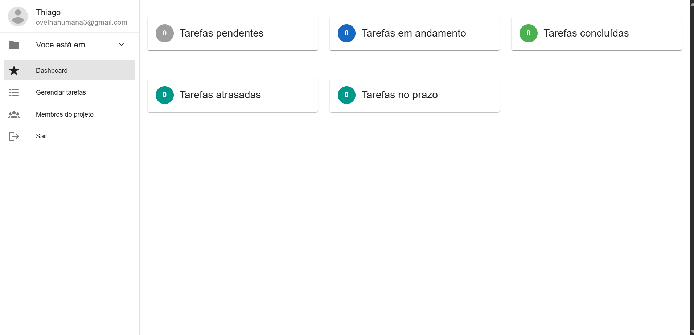
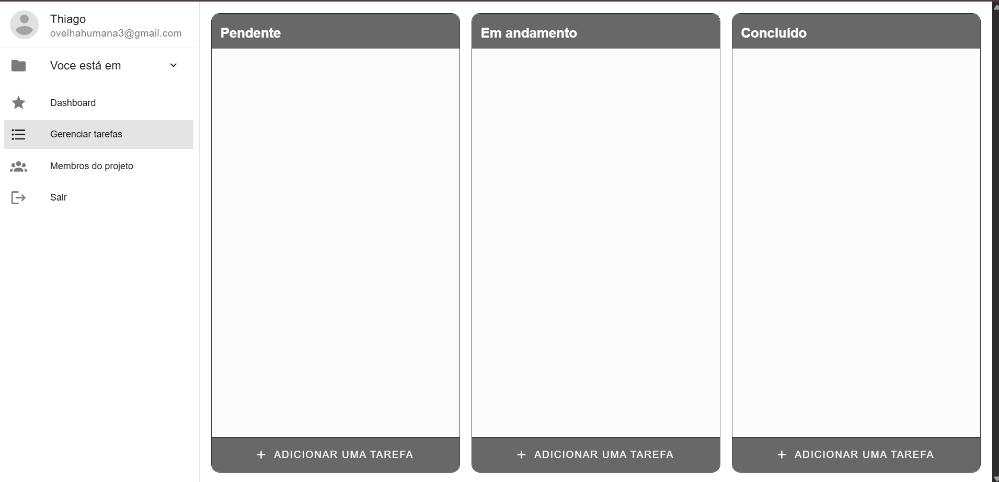
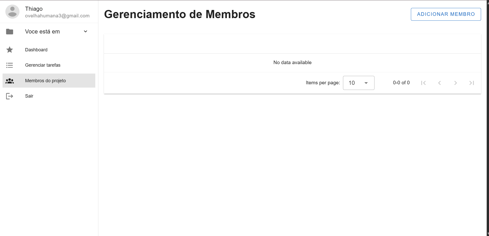
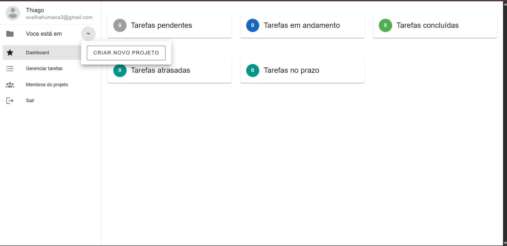

# desafio-tecnico-watch-brasil

## Sobre o Projeto

Este projeto é um desafio técnico para a Watch Brasil. Ele consiste em uma aplicação desenvolvida para demonstrar habilidades em desenvolvimento de software.

## Arquitetura

A arquitetura do backend segue a estrutura Controller -> Service -> Repository

### Onde: 
- Controller é responsável por receber os parametros de entrada e coletar a saída produzida pelo service
- Service é responsável por executar a lógica principal da aplicação (regras de negócio)
- Repository é responsável pelas manipulações realizadas no banco de dados

#### Banco de dados: PostgresSQL ( a criação da estrutura do banco será realizada no momento que o docker-compose for executado)

## Documentação
A API possui uma documentação nos padrões OpenAPI que pode ser consultada em `http://localhost:3000/docs` (ou a porta que você tenha escolhido)
## Dependências

- Node.js (>= 22.19)
- npm
- Outras dependências estão listadas no arquivo `package.json`

## Instalação

1. Clone o repositório:
    ```bash
    git clone https://github.com/ThiagoSiqueiraa/desafio-tecnico-watch-brasil.git
    cd desafio-tecnico-watch-brasil
    ```


## Executando o Projeto

Para rodar o projeto em ambiente de desenvolvimento:

Crie um .env para o backend com base no .env para funcionamento do sistema.

```bash
cd docker 
docker-compose up
```

A API estará disponível em `http://localhost:3000` (ou porta configurada, caso a porta tenha sido alterada, é necessário alterar também no docker-compose o espelhamento da porta).

O frontend estará disponível em `http://localhost:5173` (ou porta configurada, caso a porta tenha sido alterada, é necessário alterar também no docker-compose o espelhamento da porta).

## Testes

Para rodar os testes:

```bash
cd backend
npm i
npm run test:jest
```


## Telas

### Login


### Registro



### Dashboard
#### Tela onde fica os relatórios básicos da aplicação


### Gerenciar tarefas
#### Tela onde é possível cadastrar tarefas, acompanhar progresso, editar progresso. (CRUD)


### Gerenciar de membros do projeto
#### Tela onde é possível cadastrar membros que irão coloborar com o projeto, sendo possível criar tarefas, editar tarefas

## Observações


### Modal para criar novo projeto
#### Este passo é importante para conseguir criar tarefas, para isso você precisa estar em um projeto, após a criação, volte a listagem e escolha o projeto criado.

## Observações
Consulte o arquivo `package.json` para mais detalhes sobre as dependências e scripts disponíveis.
